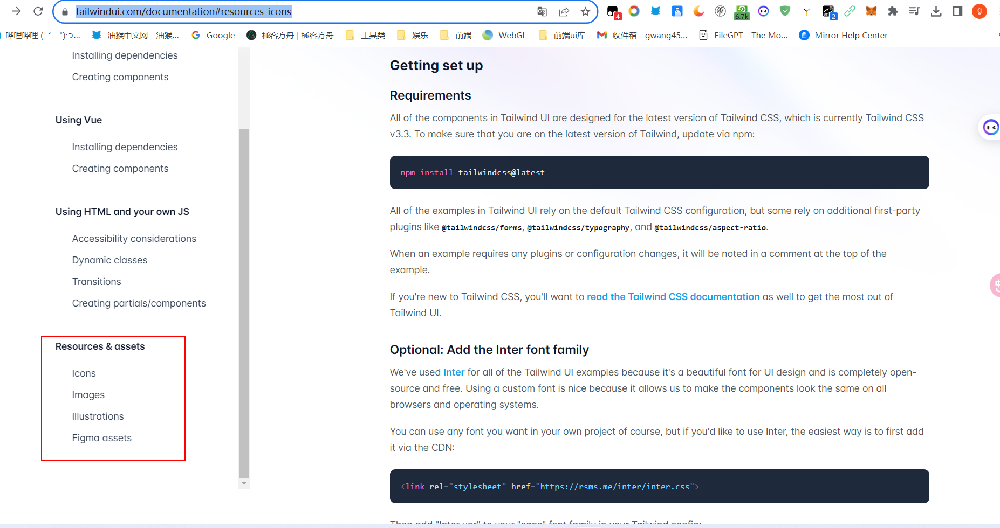
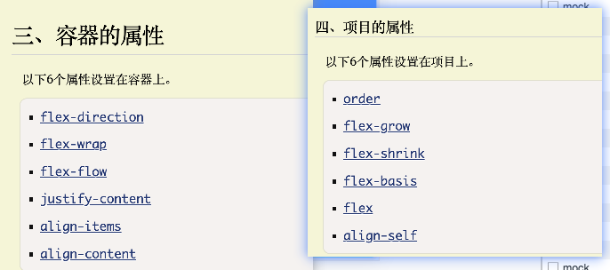

# 准备工具
* 插件 Tailwind CSS IntelliSense 给提示

# 官网内容
* https://tailwindui.com/documentation#resources-icons  想要获取所有内容都应该看这个文档

* 图标，图片，插图都在下图获取

# when i use tailwind.css with next.js, I found tailwind could  className={'flex'}, class='flex', className='flex' is ok, i should which one?

* 我暂时会先选择className='flex'这种写法

# 小技巧
* w,h可以直接写几分之几
* ctrl+i 手动唤出tailwind的提示
* 发现tailwindcss布局flex布局对熟练程序要求很高

# 注意事项
* 组件就写成.jsx不要写成js,否则写类的时候不会有提示

# 部署到vercel
* https://imitate-github.vercel.app/  这个是模仿github部署的地址

* 其实就是傻瓜式操作，然后就是我们在导入我们github仓库某个分支的url地址以后，会允许你在vercel也起一个名字，这个名字是不需要和仓库名字一样的

