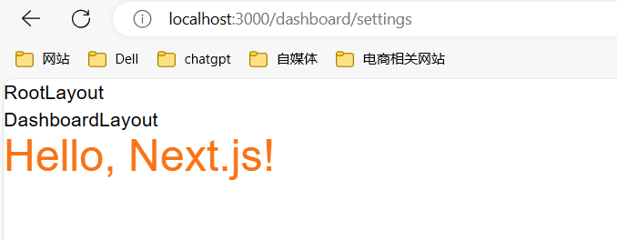
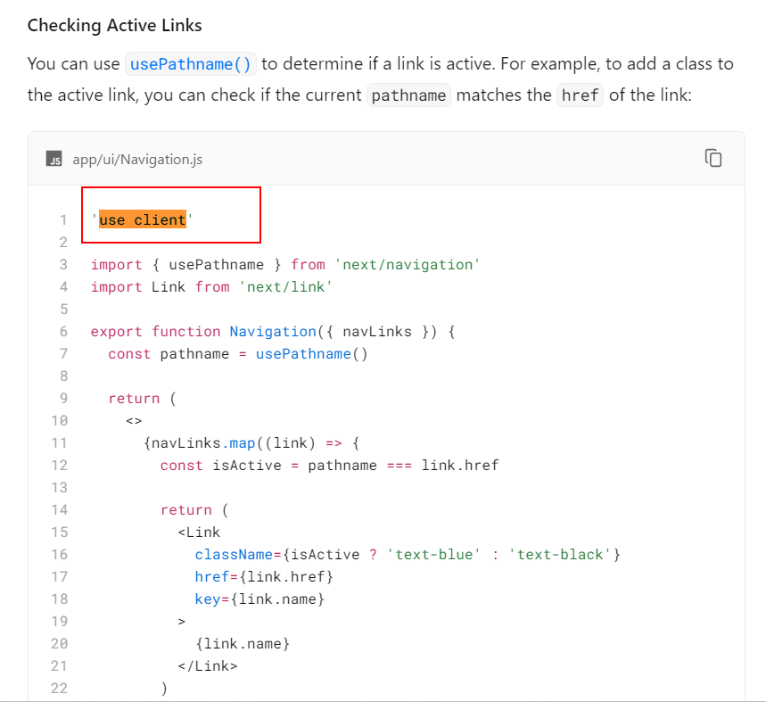
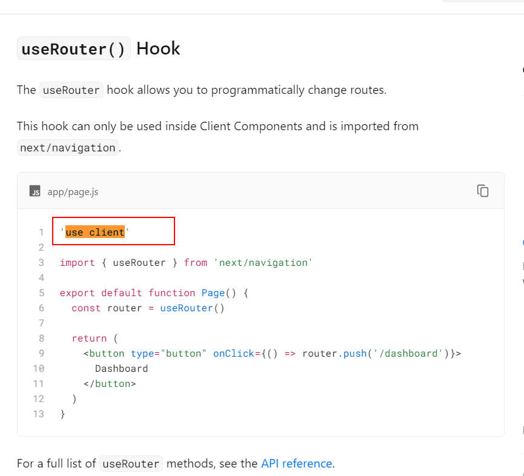
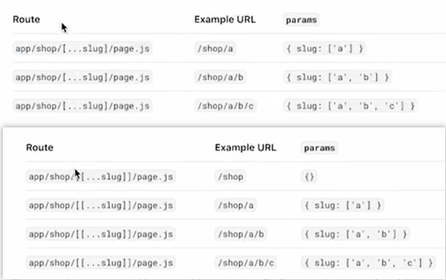

# jsconfig.js
js的配置文件

# public
存放静态资源

# src
这个是根据初始化的时候选择的不同应该展示的就不同，src -> app下面的page.js是主入口

# app路由约定

# globals.css
全局css

# tailwind常用样式
text-orange-500  文本颜色orange,500是色号 
text-4xl 字体大小

# tailwind插件
Tailwind CSS IntelliSense


# layout是用来层级嵌套的(类似父类子类的继承关系)




# layout.js
layout.js是在多个页面共享的ui

# Linking and Navigating
通常我们说的链接就是a标签，通过href跳转路径
next.js里面我们用的是Link

## 路由请求可以是动态的，比如id这种可变的
## 写博客的时候的文章列表，跳转到文章详情的时候这个时候就要求是可变的
## 使用usePathname获取pathname
```javascript
const pathname = usePathname();
const isActive = pathname === link.href
```


使用usePathname和useRouter最上面要加'use client',不写是会报错的

# 路由组
路由组是(文件夹名字)这样写
路由组不参与url路径，什么意思呢，就是比如你创建了一个(marketing)下面创建了一个about文件夹里面有一个page.js  url地址为localhost:3000/about即可访问到

## 现在其实遇到一个问题就是我有一个文件夹是blog, 有一个是(marketing)下面有一个blog,安装这个项目是访问到了marketing下面的blog,目前还不知道原因


# 如何设置动态路由


分为三种写法一种是[id],[...id]一种[[...id]],根据自己需求来写
一个层级不能同时出现[...id]和[[...id]]


## [id]
* 只能获取一层
## [...id]
* 可以获取多层
## [[...id]]


当我的层级是
- blog
-- [slug]
--- page.js

我输入localhost:3000/blog/slug 可以进入到slug下面的page.js
输入localhost:3000/blog/slug 报404
输入localhost:3000/blog/a 进入了slug下面的page.js并获取到参数为a

# 加载ui和流式传输
就是给用户加载效果

# 并行路由
* 可以理解为多条生产线同时进行，单核已经是极限了，为了提高CPU的利用率
* 写法@+文件名  举例: @blog

# 小技巧
* 我觉得初学者更多关注点应该在page.js里面，layout.js我感觉类似于antd-design组件的导航功能
* next最牛的就是它的路由配置


# 小细节
* import Loading from '@/app/loading.js'  不要写成@app/loading.js
* layout.js的传参默认写的是{children}，但是我们写成props的时候要把{}去掉


# 问题
1.使用@team访问不到，报404还没有找到原因

